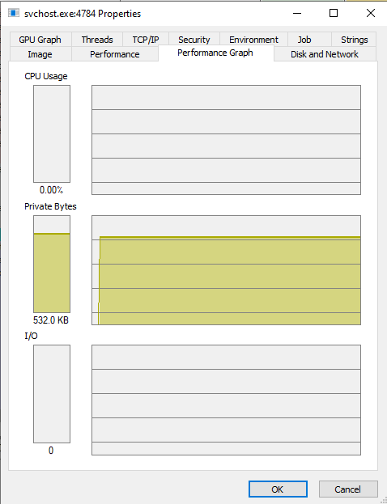
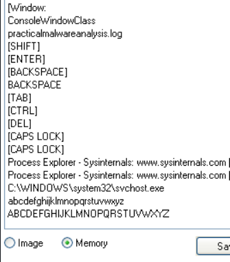

# Lab 03-03

> Execute the malware found in the file Lab03-03.exe while monitoring it using basic dynamic analysis tools in a safe environment.

- Questions:
  - 1. What do you notice when monitoring this malware with Process Explorer?
  - 2. Can you identify any live memory modifications?
  - 3. What are the malware’s host-based indicators?
  - 4. What is the purpose of this program?

## 1) What do you notice in Process Explorer?

- When the lab is executed, it spawned a `svchost.exe` process, and a file called `practicalmalwareanalysis.log` was created in the working directory. The original program terminated, but svchost.exe stayed. Image properties list `Lab03-03.exe` as the parent process, and the working directory as it's current directory.

- Watching performance graph for `svchost.exe`, disk I/O spikes during typing.

- Only file handles are to the working directory and a device, `\Device\KsecDD`. If `svchost.exe` is writing to a file through the device, Process Explorer won't see it.

## 2) Can you identify any live memory modifications?

- Looking at svchost's properties in Process Explorer allows you to compare the strings of the image on disk and in memory, and identify discrepencies.

- Not only are the strings in the virtual instance of svchost.exe different (indicating runtime changes), but they are very suggestive of a keylogger. `SetWindowsHookExA`, `practicalmalwareanalysis.log`, and `[CAPS LOCK]` in particular.

## 3) Host based indicators?

- An instance of svchost.exe with no services, a non-`services.exe` parent, and a non-`System32` working directory.
- A text file named `practicalmalwareanalysis.log`, containing strings that match those found in the malicious `svchost.exe`.

## 4) Purpose of the program?

- This program is a very obvious local keylogger that gets elevated privilege via process replacement of svchost.exe, which runs with `SYSTEM` privileges. Guessing that it uses hooking to capture keystrokes, and logs to disk through the device `\Device\KsecDD`, making it harder to detect.
